# SafeMotion

<p align="center">
Fall and inactivity monitoring platform with mobile sensor collection, real-time caregiver dashboard, alerts, and device-token authorization.
</p>

<p align="center">
  
  
  
  
  
  
  
  
  
</p>

---

## Project Overview

SafeMotion is a Node.js Web Programming term project built for the **Fall and Inactivity Detection** scenario.

The system monitors a person through a paired mobile phone. The phone collects accelerometer and gyroscope readings, uploads timestamped sensor data to the backend, and receives fall confirmation prompts when risky movement is detected. A caregiver uses the web dashboard to manage monitored persons, pair devices, view live motion data, receive alerts, and resolve incidents.

The project focuses on a complete demo-ready workflow:

- Mobile sensor data collection with accelerometer and gyroscope.
- RESTful Node.js backend with validation, authentication, authorization, and detection logic.
- PostgreSQL database with Prisma models for users, monitored persons, devices, readings, detection events, confirmations, alerts, and system logs.
- Real-time React dashboard using Socket.IO.
- Mobile fall confirmation flow.
- Alert creation, listing, live display, CSV export, and resolve workflow.
- Swagger/OpenAPI documentation, logging, automated tests, and Docker Compose support.

---

## Screenshots

### Dashboard Login

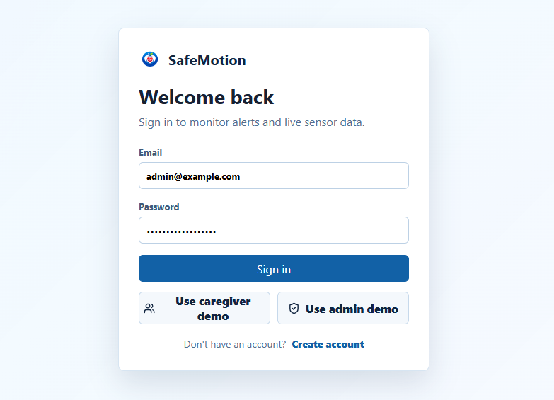

### Dashboard Overview

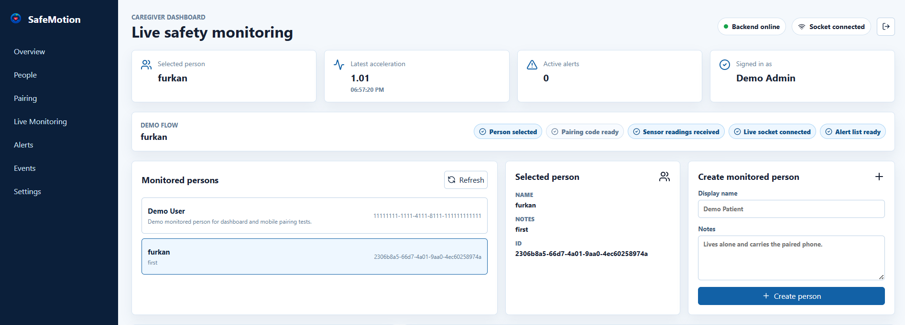

### Monitored Person Management

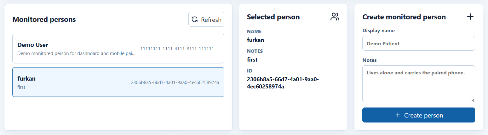

### Device Pairing

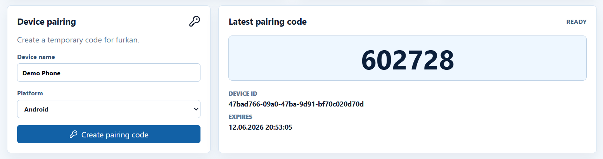

### Live Motion Readings and Events

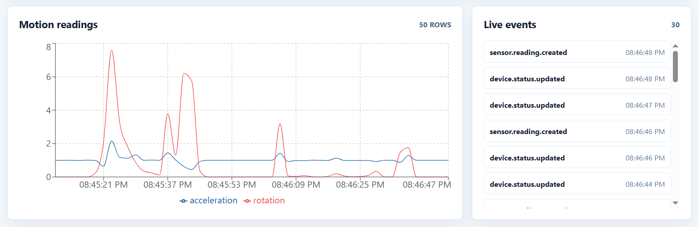

### Alert Workflow

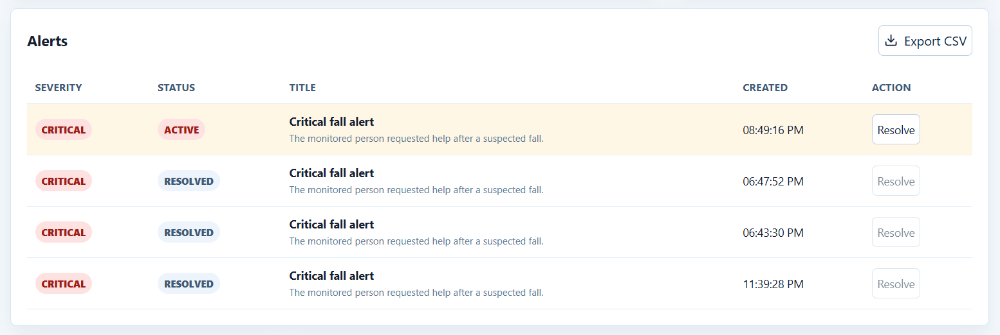

### Mobile Monitoring

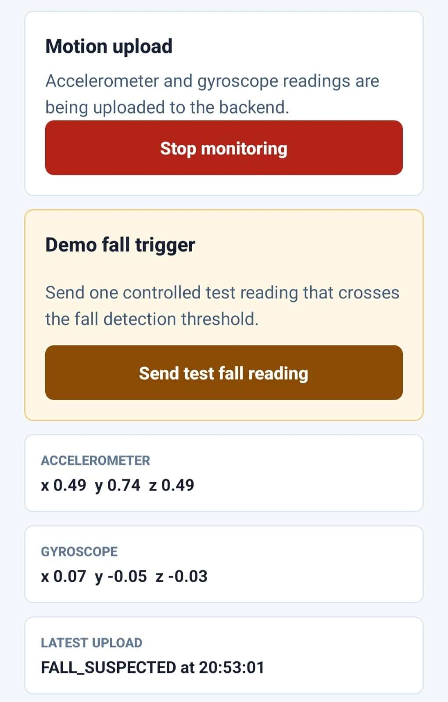

### Mobile Confirmation

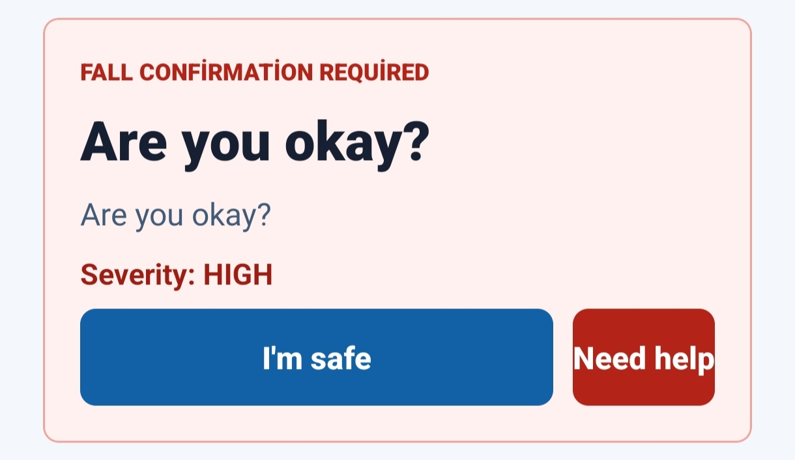

### Admin User Management

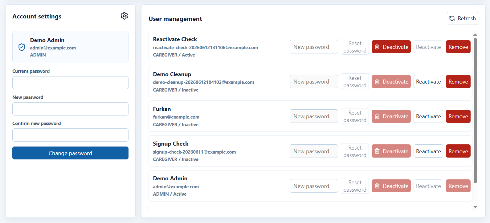

### Backend Tests

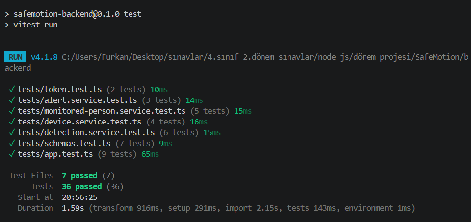

### Docker Compose

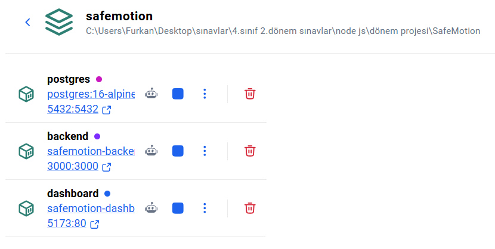

---

## Architecture

```text
Mobile App
  |-- Pairing code
  |-- Device token
  |-- Accelerometer + gyroscope readings
  v
Backend API
  |-- REST endpoints
  |-- Zod validation
  |-- JWT auth for dashboard users
  |-- Device-token auth for mobile devices
  |-- Fall and inactivity detection
  |-- Socket.IO events
  v
PostgreSQL Database
  |-- Users
  |-- Monitored persons
  |-- Devices
  |-- Sensor readings
  |-- Detection events
  |-- Confirmation responses
  |-- Alerts
  |-- System logs
  ^
  |
Dashboard
  |-- Caregiver/admin login
  |-- Monitored person management
  |-- Device pairing
  |-- Live readings and events
  |-- Alert resolution
  |-- CSV export
```

The mobile device is not a user role. It becomes authorized only after pairing and uses a device token for mobile-only operations. Dashboard users authenticate with JWT and use role-based authorization through `ADMIN` and `CAREGIVER` roles.

---

## Technology Stack

| Layer | Technologies |
| --- | --- |
| Backend | Node.js, Express, TypeScript |
| Database | PostgreSQL, Prisma ORM |
| Authentication | JWT, bcrypt |
| Validation | Zod |
| Real-time | Socket.IO |
| Dashboard | React, Vite, TypeScript, Recharts, lucide-react |
| Mobile | React Native, Expo, TypeScript, Expo Sensors, Expo SecureStore |
| API Docs | Swagger / OpenAPI |
| Logging | Pino, pino-http |
| Testing | Vitest, Supertest |
| Deployment | Docker Compose |

---

## Main Features

- Public caregiver signup and JWT login.
- Seeded admin and caregiver demo accounts.
- Admin user management with deactivate, reactivate, remove, and password reset actions.
- Monitored person creation and selection.
- Pairing code generation from the dashboard.
- Device-token authorization for mobile clients.
- Accelerometer and gyroscope upload from a physical phone.
- Threshold-based fall suspicion detection.
- Inactivity escalation after a suspected fall.
- Mobile confirmation screen with `I'm safe` and `Need help` actions.
- Safe demo fall trigger from the mobile app.
- Live dashboard updates through Socket.IO.
- Motion readings chart and live event stream.
- Alert list, active alert display, resolve workflow, and CSV export.
- Swagger/OpenAPI documentation.
- Docker Compose setup for PostgreSQL, backend, and dashboard.
- Automated backend tests.

---

## Demo Accounts

The seed script creates two demo accounts:

| Role | Email | Password |
| --- | --- | --- |
| Admin | `admin@example.com` | `StrongPassword123!` |
| Caregiver | `caregiver@example.com` | `StrongPassword123!` |

Public signup creates `CAREGIVER` accounts only. Admin accounts are intentionally created through seed data or admin-controlled operations.

---

## Detection and Alert Workflow

1. The caregiver creates or selects a monitored person.
2. The dashboard generates a temporary pairing code.
3. The mobile app pairs with the code and receives a device token.
4. The mobile app uploads timestamped accelerometer and gyroscope readings.
5. The backend stores readings and evaluates motion thresholds.
6. A suspected fall opens a confirmation request.
7. The mobile app displays `Are you okay?`.
8. `I'm safe` closes the event without a critical alert.
9. `Need help` creates a critical alert.
10. Continued inactivity after a suspected fall can also escalate to an alert.
11. The caregiver sees the alert live on the dashboard and resolves it.

---

## API Documentation

Swagger UI is available after the backend starts:

```text
http://localhost:3000/api-docs
```

Main endpoint groups:

- Auth
- Users
- Monitored persons
- Device pairing
- Sensor readings
- Confirmation responses
- Alerts
- Dashboard summary
- CSV export

---

## Setup and Running

### 1. Clone the Repository

```bash
git clone https://github.com/AFurkanOcel/SafeMotion.git
cd SafeMotion
```

### 2. Start with Docker Compose

Docker Desktop must be running.

```bash
docker compose up --build
```

This starts:

- PostgreSQL on `localhost:5432`
- Backend API on `http://localhost:3000`
- Dashboard on `http://localhost:5173`

Backend health check:

```bash
curl http://localhost:3000/api/v1/health
```

### 3. Run the Mobile App on a Physical Phone

Create `mobile/.env` from `mobile/.env.example`.

Use your computer's local Wi-Fi IP address:

```env
EXPO_PUBLIC_API_BASE_URL=http://PC_LOCAL_IP:3000/api/v1
EXPO_PUBLIC_SOCKET_URL=http://PC_LOCAL_IP:3000
```

Then start Expo:

```bash
cd mobile
npm run start -- --host lan
```

Scan the QR code with Expo Go. The phone and computer must be on the same Wi-Fi network.

---

## Local Development Commands

### Backend

```bash
cd backend
npm install
npm run typecheck
npm run build
npm run test
npm audit --audit-level=moderate
```

### Dashboard

```bash
cd dashboard
npm install
npm run typecheck
npm run build
npm audit --audit-level=moderate
```

### Mobile

```bash
cd mobile
npm install
npm run typecheck
npm audit --audit-level=moderate
```

---

## Demo Flow

Recommended jury/demo flow:

1. Open the dashboard at `http://localhost:5173`.
2. Sign in with the caregiver or admin demo account.
3. Create or select a monitored person.
4. Generate a pairing code.
5. Open the mobile app with Expo Go.
6. Enter the pairing code on the phone.
7. Start monitoring on the mobile app.
8. Show live motion readings on the dashboard.
9. Use `Send test fall reading` on mobile.
10. Show the mobile `Are you okay?` confirmation screen.
11. Tap `Need help`.
12. Show the critical alert on the dashboard.
13. Resolve the alert.
14. Export alert history as CSV.
15. Open Swagger API documentation.
16. Optionally run backend tests.

---

## Project Structure

```text
SafeMotion/
|-- assets/
|   |-- icons/                 Application icons
|   `-- screenshots/           README screenshots
|-- backend/
|   |-- prisma/                Prisma schema and seed data
|   |-- src/
|   |   |-- config/            Environment and detection config
|   |   |-- controllers/       Express controllers
|   |   |-- docs/              OpenAPI document
|   |   |-- middleware/        Auth, validation, and error middleware
|   |   |-- routes/            REST route modules
|   |   |-- schemas/           Zod request schemas
|   |   |-- services/          Business logic
|   |   |-- sockets/           Socket.IO setup and events
|   |   |-- types/             Shared backend types
|   |   `-- utils/             Helpers
|   `-- tests/                 Backend unit and integration tests
|-- dashboard/
|   |-- public/                Static dashboard assets
|   `-- src/                   React dashboard source
|-- docs/                      Planning and design documentation
|-- mobile/
|   |-- assets/                Mobile assets
|   `-- src/                   Expo mobile source
|-- docker-compose.yml
`-- README.md
```

---

## Documentation

Additional project documentation:

- [Requirements](docs/requirements.md)
- [Architecture](docs/architecture.md)
- [Data Model](docs/data-model.md)
- [API Design](docs/api-design.md)
- [Roadmap](docs/roadmap.md)
- [Test Scenarios](docs/test-scenarios.md)
- [Demo Flow](docs/demo-flow.md)
- [Setup Guide](docs/setup-guide.md)

---

## Team and Responsibilities

| Member | GitHub | Responsibility |
| --- | --- | --- |
| Mustafa Can Ersoy | [MustafaCanErsoy](https://github.com/MustafaCanErsoy) | Problem analysis, system architecture, core workflow, and high-level data model |
| Umut Kocatepe | [UmutKocatepe](https://github.com/UmutKocatepe) | Backend development, REST API design, authentication/authorization, and technical database implementation |
| Adem Berk Yüksel | [csharp-craftsman](https://github.com/csharp-craftsman) | Dashboard UI, real-time monitoring, alert management, and user operations |
| Ahmet Furkan Öcel | [AFurkanOcel](https://github.com/AFurkanOcel) | Mobile app, phone pairing, sensor upload flow, tests, bonus features, and final demo integration |

---

## Design Notes

- Device access is implemented with device token authorization, not user roles.
- Public signup creates caregiver accounts only.
- Raw device tokens are returned only once and stored as hashes.
- Passwords are hashed with bcrypt.
- Validation is handled with Zod before controller logic.
- Dashboard sockets use JWT authentication.
- Mobile data upload uses device-token authentication.
- Detection is threshold-based and designed for an academic prototype/demo context.
- The mobile demo fall trigger exists to make the jury demo safe and repeatable.

---

## Out of Scope

The following features were intentionally excluded:

- Camera event capture.
- Map-based tracking.
- Raspberry Pi integration.
- Python microservice.
- On-device AI model.
- PDF export.

---

## License

This project was developed for educational purposes.
